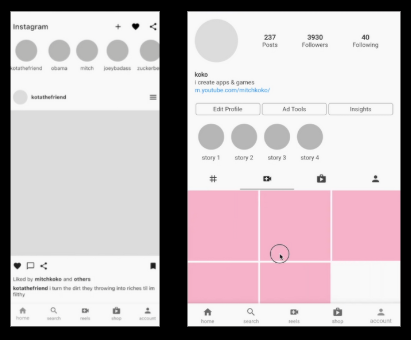

# 📱 UI do Instagram 


## 📝 Descrição

Este projeto é uma recriação da **antiga interface do Instagram** desenvolvida em **Flutter**, com o objetivo de praticar a construção de layouts utilizando widgets fundamentais como `Row`, `Column`, `ListView` e outros.
O foco principal é o **treinamento prático em design de interface e estruturação visual de aplicativos móveis**.

## 🎥 Demonstração



## ⚙️ Funcionalidades

* Feed com **posts simulados**
* Barra de navegação inferior
* Exibição de **stories** no topo
* AppBar com **ícones e logo do Instagram**

> Este projeto é voltado exclusivamente para o **visual (UI)**.
> Não há backend, autenticação ou lógica funcional implementada.

## 🧠 Tecnologias

* **Flutter** 3.x
* **Dart**
* Widgets de layout: `Row`, `Column`, `Expanded`, `Padding`, `Container`, `ListView`, entre outros

## 🚀 Como executar

1. Clone este repositório

   ```bash
   git clone https://github.com/SeuUsuario/instagram_ui_clone.git
   ```
2. Acesse a pasta do projeto

   ```bash
   cd instagram_ui_clone
   ```
3. Instale as dependências

   ```bash
   flutter pub get
   ```
4. Execute o projeto

   ```bash
   flutter run
   ```

## 👨‍💻 Autor

**Thiago Valmir Cardoso**
[LinkedIn](https://www.linkedin.com/in/thiago-valmir-cardoso) | [GitHub](https://github.com/ThiagoValmir)

## 📝 Licença

Este projeto é de uso livre para fins educacionais e de estudo.

## Créditos

Este projeto foi desenvolvido como parte do meu aprendizado em Flutter, acompanhando o seguinte tutorial:

🎥 **[Instagram UI Clone Using Flutter](https://www.youtube.com/watch?v=z5PH2s9ytl8)**  

